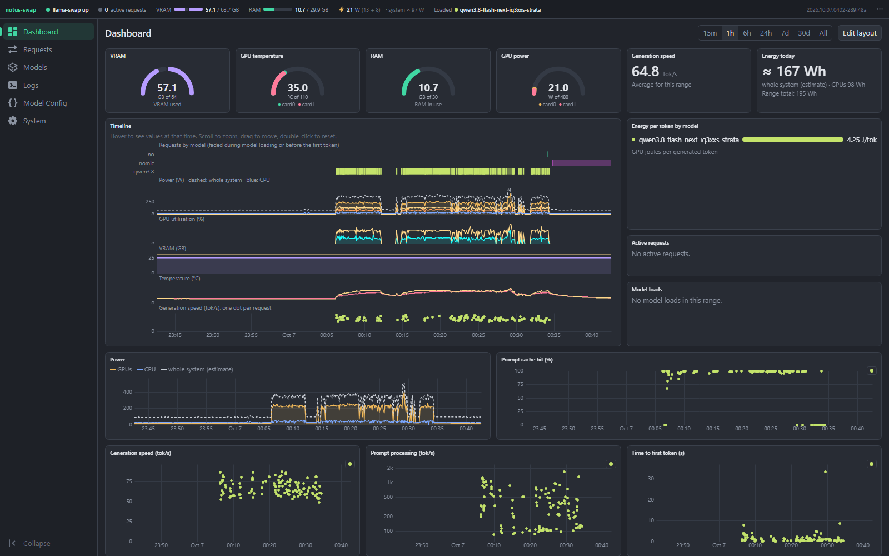
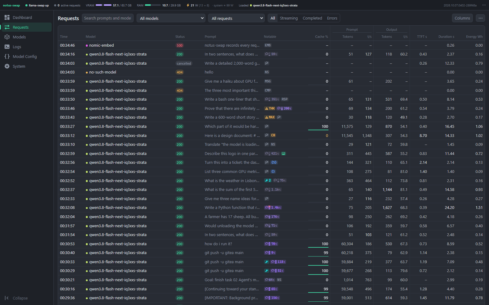
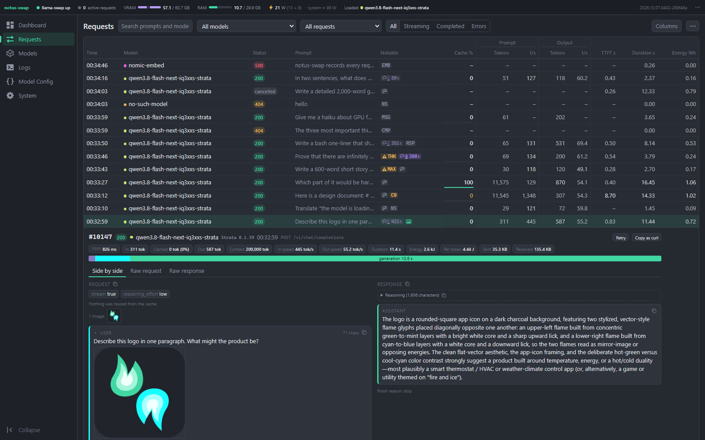
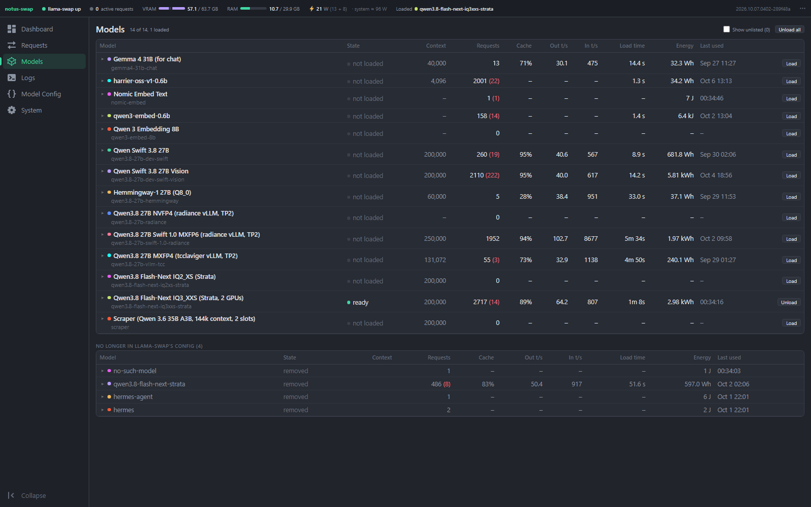

# notus-swap

notus-swap is a proxy and web UI that sits in front of [llama-swap](https://github.com/mostlygeek/llama-swap). llama-swap starts and stops local LLM servers on demand. notus-swap adds these features on top of it:

- It records every inference request and response, and shows responses live while they stream.
- It measures GPU and CPU power, and works out the energy each request used.
- It has a dashboard of graphs you can arrange yourself.
- From the browser, you can edit llama-swap's config, load and unload models, restart llama-swap, and update notus-swap, llama-swap, or llama.cpp.

llama-swap itself is not changed. notus-swap runs as its own service and passes every request through to it. So llama-swap can be updated as usual.

It was built for one machine with AMD Radeon GPUs, but nothing in it is tied to that machine.



## Screenshots

**Requests.** Every request, with its status, chips for tool calls, thinking, images, JSON and problems, and its speeds and energy.



**An opened request.** The request and the response side by side, with timings, an image the request sent, and the model's reasoning folded away.



**Models.** Every model in llama-swap's config, with its requests, cache use, speeds, load time and energy.



## Features

- **Requests.** A table of every request, with in-flight requests at the top, updating as tokens arrive. Open a request to see the messages and the response side by side. Markdown is rendered, and reasoning and tool calls are shown separately. Each request shows time to first token, tokens per second, energy used, and how much of the prompt came from the cache. It also shows which llama.cpp build answered it. A Notable column marks tool calls, thinking, images, JSON output, and prompts that missed the cache. There is also a "Copy as curl" button. A request still running can be cancelled, and a finished one can be sent again with Retry.
- **Problem flags.** Each finished request is checked for answers that were cut off. The check tells apart the request's own token limit, the server's limit, a full context, and a used-up thinking budget. It also notes requests that came close to filling the context. The Requests page can filter by these flags, and each kind can be muted per model.
- **Dashboard.** A drag-and-drop grid of widgets: power, VRAM, temperature and GPU use per card, tokens per second per model, time to first token, requests in flight, model loads and swaps, and energy per token. The layout is saved on the server. On a phone, the widgets stack in one column.
- **Models.** Load and unload models, with per-model totals, speeds, load times, logs, and recent requests. Each model also shows its speed on each llama.cpp build and each launch command it has run with, and which flags changed between commands.
- **Logs.** llama-swap's logs and notus-swap's own log, one or two side by side.
- **Model Config.** A YAML editor for llama-swap's `config.yaml`. It checks the file as you type, using the installed llama-swap's own `-validate`. It shows a diff before saving and keeps the last 20 backups.
- **Settings.** Start, stop, or restart llama-swap, or restart notus-swap. Update notus-swap, llama-swap, or llama.cpp, or roll any of them back. Set how long request bodies are kept.
- **Default model.** When llama-swap has had no model loaded for a set number of minutes (15 by default), notus-swap loads the model you choose. The next request then doesn't wait for a load.
- **Hidden models.** Hide chosen model names everywhere in the UI, for taking screenshots. Hidden models are still recorded.
- **Status bar.** Shows whether llama-swap is up, how many requests are running, VRAM and RAM in use, GPU watts, an estimate of the whole machine's watts, and which models are loaded. Its items can be reordered or hidden.

## How it fits together

```
clients → notus-swap (:8080) → llama-swap (127.0.0.1:8081) → model servers
```

- notus-swap's own UI and API are under `/notus/`. Every other path goes to llama-swap unchanged, so llama-swap's own UI is still at `/ui/`.
- Only POST requests under `/v1/` and `/upstream/` are recorded. Everything else passes straight through.
- Request metadata (model, timing, token counts, energy) is kept for good. Request and response bodies are deleted after 90 days, or once they pass 20 GB, whichever comes first. Both limits can be changed on the Settings page.
- Everything is stored in one SQLite file.
- If llama-swap is down, notus-swap stays up, shows that in the UI, and answers proxied requests with a 503.

**There is no login.** Only run notus-swap where it can be reached from a network you trust. Never put it on the open internet.

## Requirements

- Linux, for GPU and CPU power readings. It reads AMD GPUs from sysfs (`/sys/class/drm`) and CPU power from RAPL (`/sys/class/powercap`). Other GPUs are not measured yet, but the proxy and request viewer still work.
- A running llama-swap. The config editor needs a llama-swap new enough to have the `-validate` flag.
- To build: Go (see `go.mod`) and Node.js 24.

## Installing

Download `notus-swap-linux-amd64` from the [latest release](https://github.com/wispborne/notus-swap/releases/latest), or build it as shown below. Then follow [docs/install.md](docs/install.md). It covers the systemd units, moving llama-swap to another port, the polkit rule for the restart buttons, and the udev rule for reading CPU power.

## Building

The web UI is built into the Go binary, so build it first:

```bash
cd web
npm install
npm run build
cd ..
GOOS=linux GOARCH=amd64 CGO_ENABLED=0 go build -o notus-swap ./cmd/notus-swap
```

`GOOS` and `GOARCH` set the system the binary runs on. With them, you can build on Windows or a Mac for a Linux server. Leave them out to build for the machine you are on. On Windows, run the commands in Git Bash or WSL.

The SQLite driver is pure Go, so no C compiler is needed.

Then copy the `notus-swap` binary to the server and follow [docs/install.md](docs/install.md).

## Running

```bash
./notus-swap -listen :8080 -upstream http://127.0.0.1:8081 -db notus-swap.db
```

Then open `http://<host>:8080/notus/`.

Each setting can be a flag or a line in an `env` file:

| Flag | Env variable | Default | What it does |
| --- | --- | --- | --- |
| `-listen` | `NOTUS_LISTEN` | `:8080` | Address to listen on. Ignored when systemd passes in a socket (`notus-swap.socket`, see the install guide). |
| `-upstream` | `NOTUS_UPSTREAM` | `http://127.0.0.1:8081` | llama-swap's address |
| `-db` | `NOTUS_DB` | `notus-swap.db` | SQLite database file |
| `-llama-swap-config` | `NOTUS_LLAMA_SWAP_CONFIG` | none | llama-swap's `config.yaml`. The config editor is off without it. |
| `-llama-swap-bin` | `NOTUS_LLAMA_SWAP_BIN` | next to the config | llama-swap binary, used to check configs and for updates |
| `-llama-swap-unit` | `NOTUS_LLAMA_SWAP_UNIT` | `llama-swap.service` | systemd unit for the restart button and updates |
| `-llama-cpp-dir` | `NOTUS_LLAMA_CPP_DIR` | none | Folder of llama.cpp builds, with a `current` link to the one in use. llama.cpp updates are off without it. |
| `-llama-cpp-flavor` | `NOTUS_LLAMA_CPP_FLAVOR` | the flavor `current` uses | Which llama.cpp build to download, such as `ubuntu-rocm-10.0-x64` or `ubuntu-vulkan-x64` |
| `-system-base-watts` | `NOTUS_SYSTEM_BASE_WATTS` | `35` | Estimated power of everything except the CPU and GPUs |
| `-psu-efficiency` | `NOTUS_PSU_EFFICIENCY` | `0.90` | Power supply efficiency, for the wall power estimate |
| `-keep-days` | | `90` | Days to keep request and response bodies |
| `-keep-gb` | | `20` | Most GB of bodies to keep |
| | `NOTUS_GITHUB_REPO` | `wispborne/notus-swap` | Where notus-swap's own updates come from. Set it to nothing to turn them off. |
| | `GITHUB_TOKEN` | none | Optional. Raises GitHub's limit of 60 API calls an hour, used by update checks. |
| | `GITEA_URL`, `GITEA_REPO`, `GITEA_USER`, `GITEA_TOKEN` | none | Optional. Get notus-swap's updates from your own Gitea server instead of GitHub. See Updates below. |

Run `./notus-swap -h` for the full list.

Settings that belong to one machine, such as paths, service names, and tokens, go in the `env` file, never in the code.

## Updates

### notus-swap

Every push to `main` is built and published as a [GitHub release](https://github.com/wispborne/notus-swap/releases), named by date and commit, such as `2026.10.06.1200-a28d7c2`.

The update button on the Settings page downloads the newest release, checks its SHA-256, swaps the binary, and restarts through systemd. If the new version doesn't stay up for 30 seconds, it rolls back on its own. A Roll back button goes back to the previous version by hand. `scripts/update-notus-swap.sh` does the same from a shell, for when the web UI can't be reached.

If you build notus-swap on your own Gitea server, it can update from there instead. See "Getting updates from your own Gitea" in [docs/install.md](docs/install.md).

### llama-swap and llama.cpp

The Settings page checks GitHub for new releases of both every hour.

- **llama-swap:** an update downloads the release for this machine, checks its SHA-256, and checks llama-swap's config with the new version. Then it swaps the binary, keeping the old one as `llama-swap.bak`, and restarts llama-swap's systemd unit. If the new version doesn't answer within a minute, the old one is put back. It needs `NOTUS_LLAMA_SWAP_BIN` or `NOTUS_LLAMA_SWAP_CONFIG`.
- **llama.cpp:** builds sit side by side in `NOTUS_LLAMA_CPP_DIR`, each in its own folder, with a `current` link to the one in use. llama-swap's config should start models from `current`. An update unpacks the new build and moves the link, keeping the previous build for rolling back. Both the weekly release and the newest nightly build can be installed.

## Development

```bash
go test ./...
go vet ./...
cd web && npm run check    # type-check the UI
cd web && npm run dev      # live-reload UI on :5173, using the API at 127.0.0.1:18080, or $NOTUS_DEV_API if set
```

## Issues and pull requests

notus-swap is shared as it is. Bug reports in Issues are welcome, but answers and fixes aren't promised. Pull requests are turned off.

## License

MIT. See [LICENSE](LICENSE). Some UI code is adapted from llama-swap, which is also MIT-licensed, and keeps its notice.
